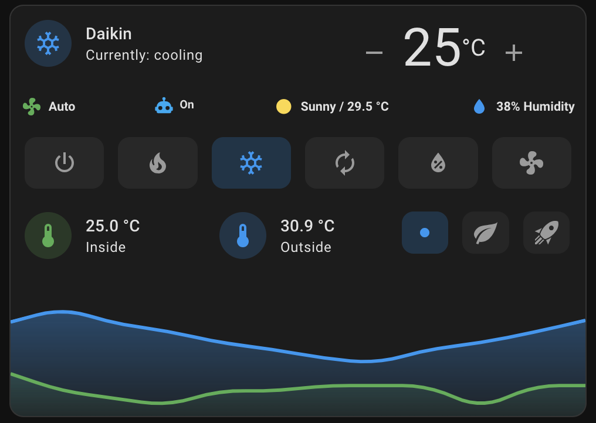

# Plassonade's Dashboard

The father of Ambient Intelligence (AmI), Mark Weiser, said:
> The most profound technologies are those that disappear. 
> They weave themselves into the fabric of everyday life until they are indistinguishable from it.

The intention behind creating this dashboard is to display only the necessary information (not raw data) in a concise and comprehensive manner to the end user of the Smart Home.

In an ideal Smart Home, dashboards wouldn't be needed. However, there are times when you still need to pick up your phone to adjust a few things. So, let's make a cool dashboard!

🚧 This is a work in progress, I will update this repository regularly as my dashboard changes 🚧

## Disclaimer

This dashboard's code is provided as-is. It is up to you to modify the entity names (sensors and devices) to make it work.

## Requirements
- [HACS] (not forcefully needed but it's gonna help you install most of the following requirements automatically)
- [Mushroom cards]
- [Stack in cards]
- [Simple thermostat]
- [Mini graph card]

[HACS]: <https://hacs.xyz/>
[Mushroom cards]: <https://github.com/piitaya/lovelace-mushroom>
[Stack in cards]: <https://github.com/custom-cards/stack-in-card>
[Simple thermostat]: <https://github.com/nervetattoo/simple-thermostat>
[Mini graph card]: <https://github.com/kalkih/mini-graph-card>

## Climate control and Weather card

The goal was to concatenate a few things into a single card:
- Air conditioning control and status (on/off/heat/cold/dry/temperature);
- Air conditioning presets (none/eco/boost);
- Inside temperature vs. outside temperature;
- Local weather: temperature and conditions;
- Possibility to turn on/off an automation*

*This automation allows me to turn on and off the A/C if presence is detected, and automatically adjust the temperature depending on how far residents are from the A/C.

## Media control

Work in progress...

## Lights control

Work in progress...

## Tech stats, server metrics

Work in progress...

## Residents status and location

Work in progress...

## Need help?
Contact me on Instagram [@plassonade], or by email: plassonade@gmail.com.

[@plassonade]: <https://instagram.com/plassonade>
[plassonade@gmail.com]: <mailto:plassonade@gmail.com>

## Shades, Roller shutters control

Work in progress...
