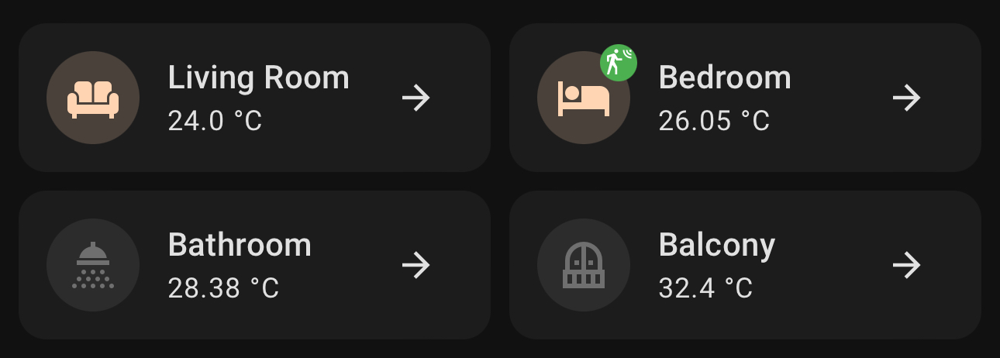
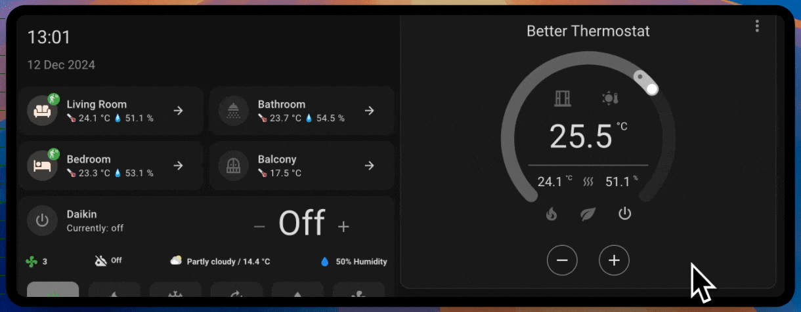

# Plassonade's Dashboard

The father of Ambient Intelligence (AmI), Mark Weiser, said:
> The most profound technologies are those that disappear. 
> They weave themselves into the fabric of everyday life until they are indistinguishable from it.

The intention behind creating this dashboard is to display only the necessary information (not raw data) in a concise and comprehensive manner to the end user of the Smart Home.

In an ideal Smart Home, dashboards wouldn't be needed. However, there are times when you still need to pick up your phone to adjust a few things. So, let's make a cool dashboard!


🚧 This is a work in progress, I will update this repository regularly as the dashboard changes 🚧

## Disclaimer

This dashboard's code is provided as-is. It is up to you to modify the entities' names (sensors and devices) to make it work.

## Requirements
- [HACS] (not forcefully needed but it's gonna help you install most of the following requirements automatically)
- [Mushroom cards]
- [Stack in cards]
- [Simple thermostat]
- [Mini graph card]
- [Card Mod]

[HACS]: <https://hacs.xyz/>
[Mushroom cards]: <https://github.com/piitaya/lovelace-mushroom>
[Stack in cards]: <https://github.com/custom-cards/stack-in-card>
[Simple thermostat]: <https://github.com/nervetattoo/simple-thermostat>
[Mini graph card]: <https://github.com/kalkih/mini-graph-card>
[Card  Mod]: <https://github.com/thomasloven/lovelace-card-mod>

## Want to replicate my setup?

You can find my Smart Home setup [by following this link].

[by following this link]: <https://linktr.ee/plassonade>

If you order from here, it won't cost you anything more but I will receive a small commission from your purchases. Thanks for your support!

## Room card



The intention was to have a functional and minimal card to check the status of each room at a glance.
It is also a shortcut to a more detailed view (dashboard) for each room, which is perfect for a small screen (smartphone) display.
I've designed a small card, that I duplicated for each room, and all put together in a grid component.

Each card displays:
- The light state of the room (if any light is on, the room logo will be lit up to the color of the lights);
- The temperature of the specific room;
- If presence is detected or not in that room.

Controls:
- By clicking on the room you can turn on/off the lights inside it;
- Clicking on the arrow will redirect you to the approriate dashboard.

To make this work, you just need to replace the entities for each of your rooms and copy/paste the card in the grid if you have more rooms to manage.
Also, you need to create a dashboard for each room that you will navigate to when tapping on the arrow.

### Adding radiator glow animation



You can create a radiator (or even A/C) glow to the room card by just adding a conditional animation.
The additional code needs to be at the root of each room card (stack-in-card), under the `card_mod` style, like this:
```
...
    card_mod:
      style: |
        ha-card {
          border: none;

          /* Add your thermostat entity like below with your desired condition */
          
          animation: breathing-shadow 1.5s infinite alternate ease-in-out;
          
          animation: none;
          
        }
        /* Breathing/glow animation */
        /* Feel free to change the color and intensity to your liking */
        @keyframes breathing-shadow {
          0% {
            box-shadow: 0px 0px 10px 1px #FF8C00;
          }
          100% {
            box-shadow: 0px 0px 13px 3px #FF8C00;
          }
        }
    cards:
      - type: custom:mushroom-template-card
        primary: Living Room
...
```
Replace the thermostat name with yours, but you can definitively use something else (like a switch for example) if you don't have a thermostat entity.

By the way, I highly suggest you to use the [Better Thermostat] integration to have your radiators and A/C fully automatized, [here is a video I made about it].

[Better Thermostat]: <https://github.com/KartoffelToby/better_thermostat>
[here is a video I made about it]: <https://www.instagram.com/plassonade/reel/DDQCu4EAaN7/>

## Climate control and Weather card


The goal was to concatenate a few things into a single card:
- Air conditioning control and status (on/off/heat/cold/dry/temperature);
- Air conditioning presets (none/eco/boost);
- Inside temperature vs. outside temperature;
- Local weather: temperature and conditions;
- Possibility to turn on/off an automation*

*This automation allows me to turn on and off the A/C if presence is detected, and automatically adjust the temperature depending on how far residents are from the A/C.

## Media control

Work in progress...

## Lights control

Work in progress...

## Tech stats, server metrics

Work in progress...

## Residents status and location

Work in progress...


## Shades, Roller shutters control

Work in progress...


## Need help?

Feel free to ask your questions on our Discord community, The Smart Playground.
[You can join it for free here].

[You can join it for free here]: <https://plassonade.com/links>
